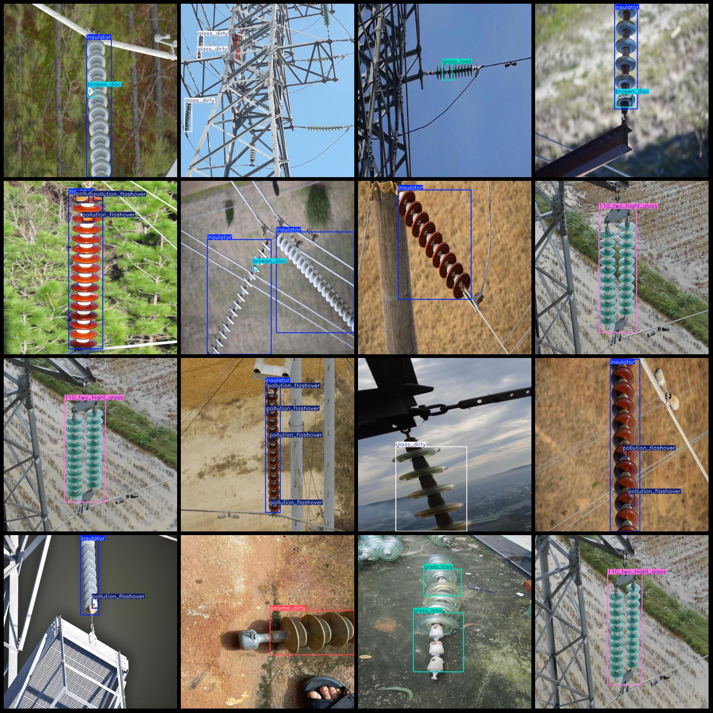
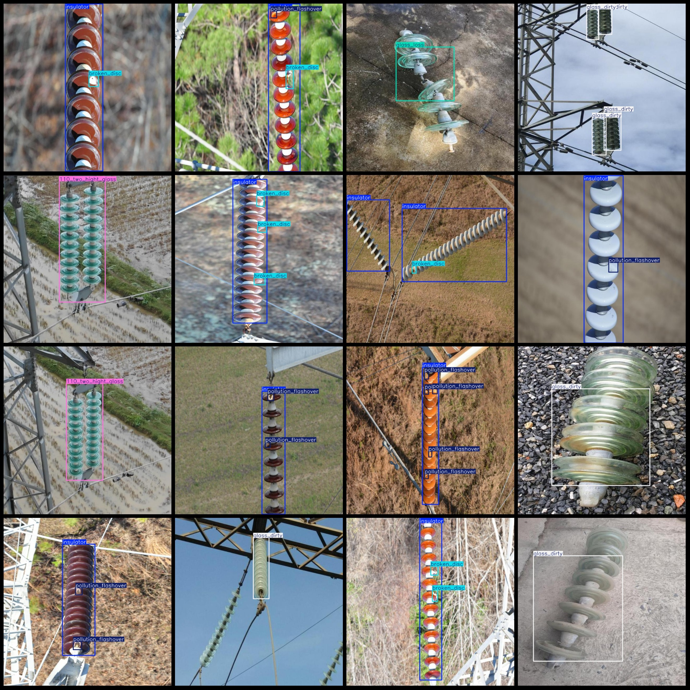

# Power Scene Insulator Defect Detection Dataset VOC+YOLO Format 2828 Images 7 Categories

The dataset format is Pascal VOC format+YOLO format. It does not include the split path in the txt file, only the jpg image and the corresponding VOC format xml file and yolo format txt file.
Number of images (number of jpg files): 2828
annotation count: 2828  
annotation count: 2828  
annotationnumber of classes: 7  
Annotation class names: ["110_two_hight_glass", "broken_disc", "glass_dirty", "glass_loss", "insulator", "pollution_flashover", "polyme_dirty"]
boxes per class:   
110_two_hight_glass (110kV double-spaced glass insulator) box count = 264  
broken_disc (broken disc insulator) box count = 1092  
glass_dirty (glass dirty) box count = 501
Glass loss (glass missing) frame count = 171
1830
Pollution Flashover (pollution flashover) Frame Count = 2448
The polyme_dirty (composite insulator dirt) box count is 455.
Total frames: 6761
image resolution: 640x640  
Using annotation tool: labelImg
Annotation rules: draw a rectangle around the class.
Important notes: There are no special statements at this time.
Special statement: This dataset does not guarantee the accuracy of the trained model or weight file.
Image preview:
## Images

Here is a pay link on Stripe ( https://buy.stripe.com/3cs8yP7sY87d0vu9AB ). Please contact me lonlonago@foxmail.com after funding $89, and I will send you a complete data files , thank you!

